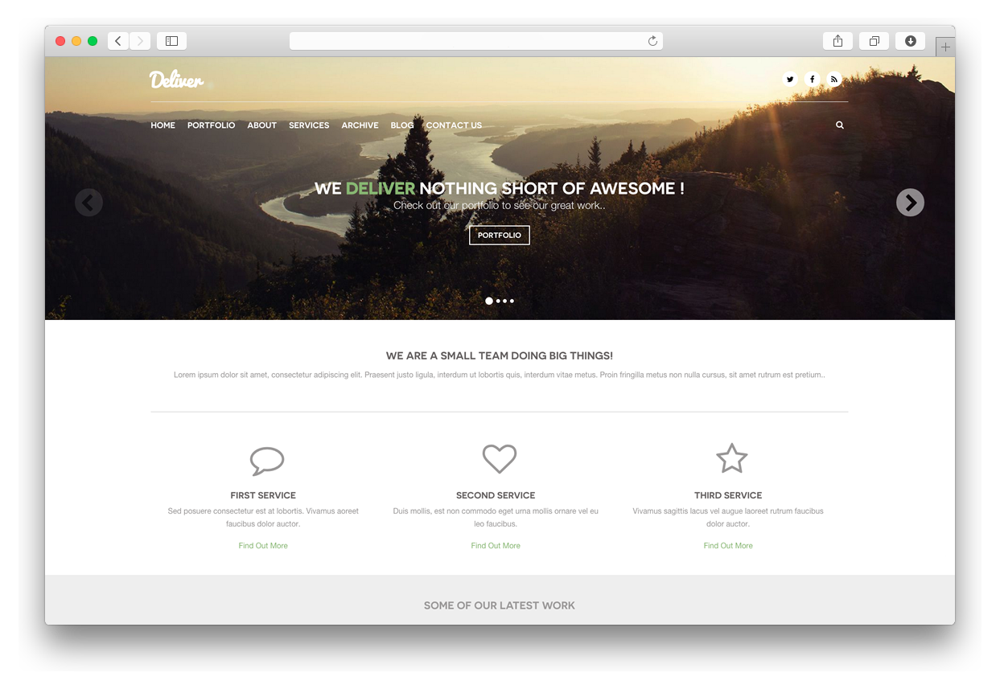

# Deliver Theme for Grav

Deliver theme is a port of the [Deliver](http://freebiesbug.com/psd-freebies/deliver-free-psd-theme/) by [Michael Reimer](http://www.bestpsdfreebies.com/). Whether you’re a creative looking to show off your portfolio, or a business looking to promote your company, this theme is for you.

# Features

* Fully responsive
* Automatic and custom navigation menus included
* Showcase section with stunning animated slideshow module
* Services grid with custom FontAwesome icons.
* Portfolio grid with modal window popup previews for portfolio item details. Both frontpage (minimal) and full featured versions included.
* Footer section with Feedburner subscription (feedburner id customizable in site config), custom menus, contact info and more.
* About layout with social icons module and custom styling
* Services layout with FontAwesome icons and pricing tables
* Archive layout with blog posts archives list
* Full featured blog with support for custom authors and jscomments
* Contact us layout with Simple Form plugin support.
* SCSS files included for deeper customization options

# Installation

Installing the Deliver theme can be done in one of two ways. Our GPM (Grav Package Manager) installation method enables you to quickly and easily install the theme with a simple terminal command, while the manual method enables you to do so via a zip file.

The theme by itself is useful, but you may have an easier time getting up and running by installing a skeleton. The [Deliver Site Skeleton](https://github.com/getgrav/grav-skeleton-deliver-site) is a self-contained repository for a complete sites which includes: sample content, configuration, theme, and plugins.

## GPM Installation (Preferred)

The simplest way to install this theme is via the [Grav Package Manager (GPM)](http://learn.getgrav.org/advanced/grav-gpm) through your system's Terminal (also called the command line).  From the root of your Grav install type:

    bin/gpm install deliver

This will install the Deliver theme into your `/user/themes` directory within Grav. Its files can be found under `/your/site/grav/user/themes/deliver`.

## Manual Installation

To install this theme, just download the zip version of this repository and unzip it under `/your/site/grav/user/themes`. Then, rename the folder to `deliver`. You can find these files either on [GitHub](https://github.com/getgrav/grav-theme-deliver) or via [GetGrav.org](http://getgrav.org/downloads/themes).

You should now have all the theme files under

    /your/site/grav/user/themes/deliver

>> NOTE: This theme is a modular component for Grav which requires the [Grav](http://github.com/getgrav/grav), [Error](https://github.com/getgrav/grav-theme-error) and [Problems](https://github.com/getgrav/grav-plugin-problems) plugins.

# Updating

As development for the Deliver theme continues, new versions may become available that add additional features and functionality, improve compatibility with newer Grav releases, and generally provide a better user experience. Updating Deliver is easy, and can be done through Grav's GPM system, as well as manually.

## GPM Update (Preferred)

The simplest way to update this theme is via the [Grav Package Manager (GPM)](http://learn.getgrav.org/advanced/grav-gpm). You can do this with this by navigating to the root directory of your Grav install using your system's Terminal (also called command line) and typing the following:

    bin/gpm update deliver

This command will check your Grav install to see if your Deliver theme is due for an update. If a newer release is found, you will be asked whether or not you wish to update. To continue, type `y` and hit enter. The theme will automatically update and clear Grav's cache.

## Manual Update

Manually updating Deliver is pretty simple. Here is what you will need to do to get this done:

* Delete the `your/site/user/themes/deliver` directory.
* Download the new version of the Deliver theme from either [GitHub](https://github.com/getgrav/grav-theme-deliver) or [GetGrav.org](http://getgrav.org/downloads/themes).
* Unzip the zip file in `your/site/user/themes` and rename the resulting folder to `deliver`.
* Clear the Grav cache. The simplest way to do this is by going to the root Grav directory in terminal and typing `bin/grav clear-cache`.

> Note: Any changes you have made to any of the files listed under this directory will also be removed and replaced by the new set. Any files located elsewhere (for example a YAML settings file placed in `user/config/themes`) will remain intact.

# Setup

If you want to set Deliver as the default theme, you can do so by following these steps:

* Navigate to `/your/site/grav/user/config`.
* Open the **system.yaml** file.
* Change the `theme:` setting to `theme: deliver`.
* Save your changes.
* Clear the Grav cache. The simplest way to do this is by going to the root Grav directory in Terminal and typing `bin/grav clear-cache`.

Once this is done, you should be able to see the new theme on the frontend. Keep in mind any customizations made to the previous theme will not be reflected as all of the theme and templating information is now being pulled from the **deliver** folder.
